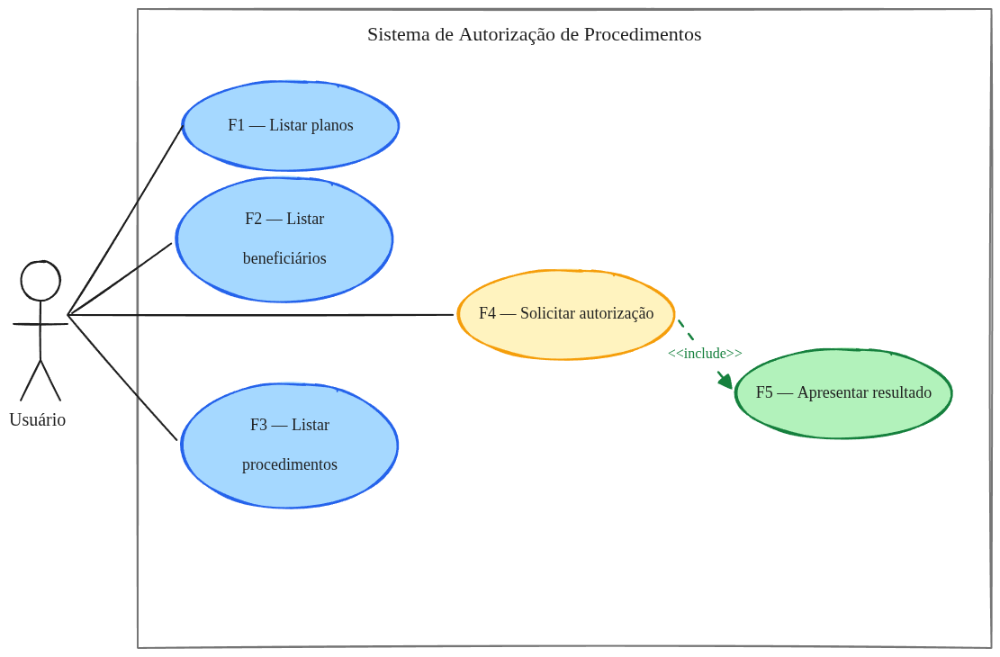
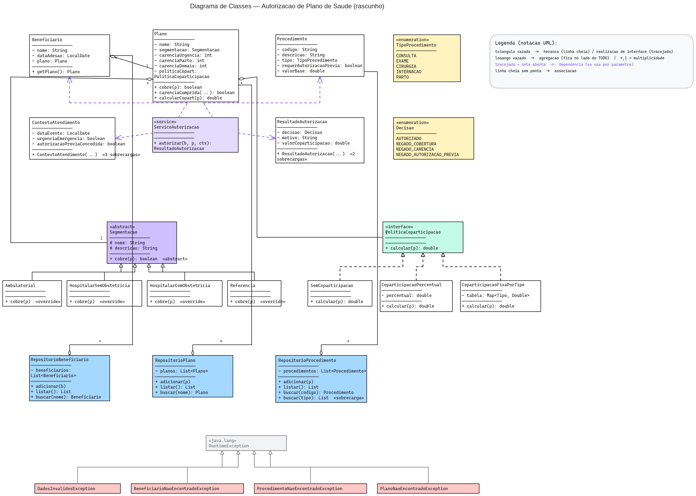

# Relatório Técnico — Estudo Dirigido 1: UML

**Aluno:** Pedro Gomes Sampaio
**Disciplina:** Programação Orientada a Objetos
**Entrega:** 28/07/2026

---

## Cenário de Referência

Os exemplos práticos deste relatório partem de um cenário do setor de saúde
suplementar: a **autorização de procedimentos por plano de saúde**.

Quando um beneficiário — pessoa coberta por um plano — precisa realizar um
procedimento médico (consulta, exame, cirurgia, internação ou parto), a operadora
precisa decidir se aquele procedimento será **autorizado ou negado**. Essa decisão
não é arbitrária: segue um conjunto de regras contratuais e regulatórias avaliadas
em sequência.

1. **Cobertura** — o plano contratado pelo beneficiário inclui aquele tipo de
   procedimento?
2. **Carência** — o beneficiário já cumpriu o tempo mínimo de adesão exigido para
   aquela categoria de procedimento?
3. **Autorização prévia** — o procedimento exige aprovação antecipada da operadora?
   Em caso afirmativo, ela foi concedida?
4. **Coparticipação** — há valor a ser pago pelo próprio beneficiário? Qual o
   montante, conforme a política do plano?

O resultado é sempre uma decisão (autorizado ou negado) acompanhada de um motivo
claro e, quando autorizado, do valor de coparticipação devido.

É esse cenário que os diagramas a seguir modelam — primeiro pelo ângulo do
comportamento esperado (casos de uso), depois pelo ângulo da estrutura que sustenta
esse comportamento (classes).

---

## 1. Diagrama de Casos de Uso

### 1.1 Fundamentação Conceitual

**Conceito**

O Diagrama de Casos de Uso é um diagrama comportamental da UML que descreve as
interações entre agentes externos — chamados de _atores_ — e um sistema, por meio
de funcionalidades observáveis chamadas _casos de uso_. O foco está no
**comportamento externo do sistema**: o que ele faz, não como o faz. Cada caso de
uso representa uma funcionalidade completa que entrega valor a pelo menos um ator.

Os elementos principais são:

- **Ator** — entidade externa que interage com o sistema (pessoa, sistema externo,
  dispositivo). Representado por um boneco palito.
- **Caso de uso** — funcionalidade que o sistema oferece a um ator. Representado por
  uma elipse com um nome que começa com verbo.
- **Sistema** — delimitado por um retângulo; os casos de uso ficam dentro, os atores
  fora.
- **Relacionamentos** — _associação_ (ator usa caso de uso), `<<include>>` (caso de
  uso sempre inclui outro), `<<extend>>` (caso de uso opcionalmente estende outro) e
  _generalização_ (ator ou caso de uso herda de outro).

**Propósito**

O diagrama serve para capturar requisitos funcionais de alto nível e comunicá-los a
diferentes públicos — clientes, analistas e desenvolvedores. É o ponto de partida do
levantamento de requisitos: antes de decidir como o sistema será construído, define-se
o que ele deve fazer e para quem.

**Aplicabilidade**

É aplicado principalmente nas fases iniciais de análise e modelagem:

- Levantamento e validação de requisitos com o cliente (linguagem acessível a
  não-técnicos);
- Definição do escopo do sistema (o que está dentro e fora do retângulo);
- Insumo para diagramas de sequência e de atividades que detalham cada fluxo;
- Documentação de referência para rastreabilidade de requisitos.

**Vantagens**

- Notação simples, legível por usuários não-técnicos.
- Centraliza o olhar no valor entregue ao ator, não nos detalhes internos.
- Facilita a descoberta de funcionalidades esquecidas ao perguntar: "quem mais usa
  isto?" e "o que mais este ator precisa?".
- Delimita o escopo de forma visual, reduzindo ambiguidade sobre o que o sistema
  cobre.

**Desvantagens**

- Não descreve fluxo, sequência nem lógica interna — apenas o quê, nunca o como.
- As relações `<<include>>` e `<<extend>>` são frequentemente mal empregadas,
  gerando modelos confusos.
- Em sistemas grandes, o diagrama pode crescer até perder legibilidade se não for
  particionado por pacotes ou subsistemas.
- Não captura requisitos não-funcionais (desempenho, segurança, disponibilidade).

---

### 1.2 Exemplo de Cenário de Uso

O diagrama a seguir modela o cenário de autorização de procedimentos na perspectiva
comportamental — o que o sistema deve fazer e para quem.

<!-- Exportar docs/entrega/caso-de-uso.excalidraw como PNG e salvar aqui -->

**Elementos identificados:**

| Elemento | Tipo | Descrição |
|---|---|---|
| Usuário | Ator | Operador do sistema (recepcionista, profissional de saúde) |
| F1 — Listar planos | Caso de uso | Consulta os planos cadastrados |
| F2 — Listar beneficiários | Caso de uso | Consulta os beneficiários cadastrados |
| F3 — Listar procedimentos | Caso de uso | Consulta os procedimentos disponíveis |
| F4 — Solicitar autorização | Caso de uso | Inicia o fluxo de autorização de um procedimento |
| F5 — Apresentar resultado | Caso de uso | Exibe a decisão (autorizado/negado) e o motivo |
| `<<include>>` | Relacionamento | F4 sempre inclui F5: toda solicitação produz um resultado apresentado |

**Leitura do modelo:** o único ator é o Usuário, que interage diretamente com as
cinco funcionalidades do sistema. A relação `<<include>>` entre F4 e F5 explicita que
F5 não é um caso de uso independente — ele é parte obrigatória do fluxo de
autorização. O sistema está delimitado pelo retângulo, deixando claro que entidades
externas como seguradoras ou prontuários eletrônicos estão fora do escopo.

---

## 2. Diagrama de Classes

### 2.1 Fundamentação Conceitual

**Conceito**

O Diagrama de Classes é o diagrama estrutural mais utilizado da UML. Representa as
**classes** de um sistema orientado a objetos — seus atributos, métodos e os
relacionamentos entre elas — capturando a estrutura estática do modelo. Cada classe
aparece como um retângulo dividido em três compartimentos: nome, atributos e
operações.

Os relacionamentos principais são:

- **Associação** — uma classe conhece a outra (linha cheia sem ponta especial).
  Pode ter multiplicidade (`1`, `*`, `1..*`, etc.).
- **Agregação** — associação "todo–parte" onde a parte pode existir sem o todo
  (losango vazio no lado do todo).
- **Composição** — agregação forte: a parte não existe sem o todo (losango cheio).
- **Herança (generalização)** — subclasse especializa superclasse (triângulo vazado,
  linha cheia).
- **Realização** — classe concreta implementa interface (triângulo vazado, linha
  tracejada).
- **Dependência** — uma classe usa outra apenas pontualmente, normalmente via
  parâmetro (seta tracejada aberta).

Outros elementos notáveis: `«interface»`, `«abstract»`, `«enumeration»` e
estereótipos personalizados como `«service»`.

**Propósito**

Modelar a estrutura interna do sistema para servir de _blueprint_(modelo) para a
implementação. Enquanto o diagrama de casos de uso responde ao "o quê", o diagrama
de classes começa a responder ao "como": quais entidades existem, que dados carregam
e como se relacionam.

**Aplicabilidade**

- Design orientado a objetos: organizar responsabilidades entre classes e identificar
  padrões de projeto aplicáveis.
- Comunicação entre desenvolvedores: visão compartilhada da estrutura antes de
  codificar.
- Documentação arquitetural de referência, útil para novos membros da equipe.
- Base para geração automática de código (engenharia avante) ou extração de modelo a
  partir de código existente (engenharia reversa).

**Vantagens**

- Mapeamento direto para código: atributos viram campos, operações viram métodos,
  relacionamentos viram referências.
- Expressa múltiplos tipos de relacionamento com semânticas distintas, tornando
  explícitas dependências e hierarquias.
- Permite identificar violações de princípios (como acoplamento excessivo) antes de
  codificar.
- Suporta diferentes níveis de abstração: modelo conceitual (domínio), especificação
  (interfaces) e implementação (código).

**Desvantagens**

- Em sistemas grandes, o diagrama se torna denso e difícil de ler sem particionamento
  cuidadoso.
- Detalhes de implementação (tipos de campos, assinaturas completas) podem sujar o
  modelo se incluídos prematuramente.
- É um modelo estático: não captura fluxo de controle, sequência de chamadas ou
  comportamento temporal.
- Requer atualização contínua — diverge rapidamente do código se não for mantido.

---

### 2.2 Exemplo de Cenário de Uso

O diagrama abaixo modela o mesmo cenário na perspectiva estrutural — quais entidades
existem, quais informações carregam e como se relacionam.

<!-- Exportar docs/entrega/diagrama-de-classes.excalidraw como PNG e salvar aqui -->

**Estrutura do modelo:**

O sistema é organizado em quatro grupos de responsabilidade:

**Domínio central**

`Beneficiario` agrega `Plano` (1:1): um beneficiário pertence a um plano, mas o
plano existe independentemente. `Plano` agrega `Procedimento` indiretamente via
`ContextoAtendimento`, passado como parâmetro na operação de autorização. `Plano`
também agrega `Segmentacao` (1:1) e `PoliticaCoparticipacao` (1:1).

**Serviço de autorização**

`ServicoAutorizacao` depende de `Beneficiario`, `Procedimento` e `ContextoAtendimento`
por parâmetro (dependência, não associação). Ele produz um `ResultadoAutorizacao`,
que encapsula a `Decisao` (enum) e o valor de coparticipação calculado.

**Padrão Strategy — cobertura e coparticipação**

`Segmentacao` é uma classe abstrata com quatro especializações concretas
(`Ambulatorial`, `HospitalarSemObstetricia`, `HospitalarComObstetricia`, `Referencia`),
cada uma implementando `cobre(p): boolean` de forma diferente. O polimorfismo
elimina condicionais do serviço.

`PoliticaCoparticipacao` é uma interface realizada por três classes concretas:
`SemCoparticipacao`, `CoparticipacaoPercentual` e `CoparticipacaoFixaPorTipo`. O
`Plano` delega o cálculo para a política atribuída — mesma mecânica do Strategy.

**Repositórios e exceções**

Três repositórios (`RepositorioBeneficiario`, `RepositorioPlano`,
`RepositorioProcedimento`) encapsulam a coleção em memória e expõem operações de
adição, listagem e busca. Quatro exceções de domínio herdam de `RuntimeException`:
`DadosInvalidosException`, `BeneficiarioNaoEncontradoException`,
`ProcedimentoNaoEncontradoException` e `PlanoNaoEncontradoException` — lançadas na
borda do sistema quando um recurso não é encontrado.

**Decisões de relacionamento relevantes**

| Relacionamento | Tipo escolhido | Justificativa |
|---|---|---|
| `Plano` → `Segmentacao` | Agregação | Segmentação existe independentemente do plano |
| `Plano` → `PoliticaCoparticipacao` | Agregação | Política é intercambiável; não é parte exclusiva |
| `ServicoAutorizacao` → entidades | Dependência | Usa apenas via parâmetro, sem referência permanente |
| `Segmentacao` → subclasses | Herança | Especialização de comportamento (Strategy via herança) |
| `PoliticaCoparticipacao` → implementações | Realização | Interface com múltiplas implementações intercambiáveis |